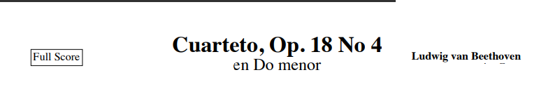
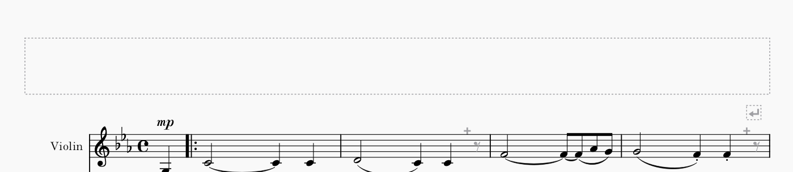
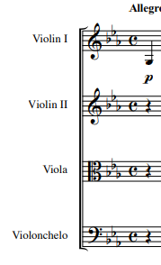
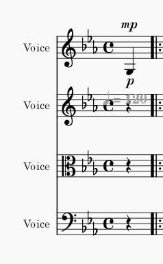
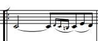
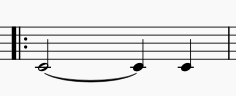
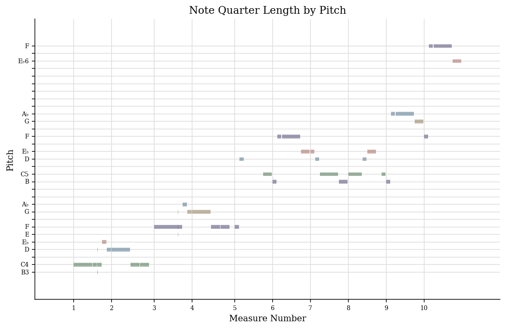
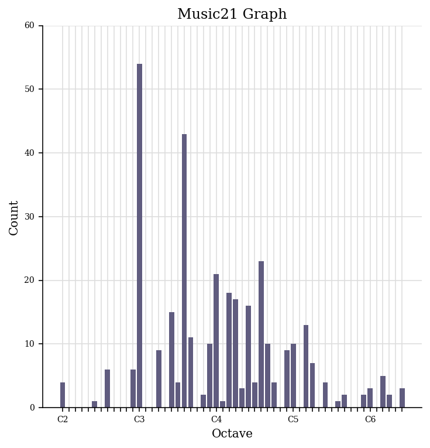

# Music Curation & Analytics 2022-23

## Week 1 Lab

### Lab Task

> Identify a theme for your dataset. This will be the central, cohesive strand that will bring your data together. It can be an artist, composer, songwriter, performer, album, larger work (i.e. opera, musical, etc.), time period, genre, archival grouping, etc. You will want to be sure that you can gather all three types of data (musical scores, metadata, and audio recordings) based on your selected theme.

The Theme:
* Holst's "The Planets" Suite - Focusing on the identity of each piece in the suite, how they contrast, build their own character, etc.

> Based on your own experience, what do you think are some challenges to working with music and music-related data (perhaps related to access, curation, distribution, etc.)?

> How does your selected theme display some of these challenges? Describe the current manifestations of data relating to your selected theme, discussing how it is presently curated (collected and gathered) and how it is presented, described, and analysed.

### Challenges & their relation to the chosen theme

Issues with sharing digital sheet music:
- Digital sheet music data has many different standards (e.g. Midi, MusicXML, proprietary file types like Sibelius’s *.sib* or Musescore’s *.mscz*.
- It can be hard to share digital music data directly between two sources/formats since the way each format saves data differs.
- Usually to share a piece of music data, a format must be converted to another standard which both softwares can understand and can convert to their own native format (e.g. sharing music between Sibelius and Musescore usually involves first converting to MusicXML, which both softwares can read and convert themselves).
- **The Planets:** The sheet music may not be easily available in  a standard digital format which can be read by certain softwares - the suite which was written before the time of digital scores *(1914-17)* and before the standards where many modern pieces can be found in.

Issues with access & distribution:
- Online libraries such as IMSLP contain many different versions of the same piece.
- Versions can vary drastically in attributes such as scan/audio quality, technical accuracy, and subjective interpretations of the piece (e.g. performance interpretation, sheet music notes, etc.).
- This can be challenging for a person to choose the version they want to learn/listen to/analyse because of this variation between sources.
- **The Planets:** Many versions of the suite can be found online or in libraries, a person who wishes to listen to the suite must choose from many different recordings, sheet music, interpretations, etc.

Issues with curation:
- Metadata for pieces of music can vary depending on the source as well as contextual information.
- For example, the “duration” of a piece can depend on the tempo of the conductor of a specific performance or interpretation - one conductor may interpret a tempo marking to be slower or faster than another conductor.
- Organising music data can be challenging due to the lack of a uniform standard for sharing music - e.g. digital recordings can have varying compression, bit rate, file format, etc. which can make it difficult to objectively analyse, compare, and organise such files.
- Metadata for these files can have differences - some may have more descriptions than others, some may have different standards for labelling specific data (for example, “number of movements” could be labelled as *3* or *Three* or *III* within the metadata of a file).
- **The Planets:** Metadata for the suite can have great variation depending on the source - orchestral pieces of music generally offer a large amount of creative freedom to the conductor/performers of a performance and properties such as tempo & dynamics can be largely up to interpretation. This results in fluctuations in metadata for the same piece - which can make it challenging to determine or analyse the piece.

## Week 2 Lab

## Lab Task

Converting PDF to Digital Score:
- Chose Beethoven String Quartet No. 4 in C minor (Op. 18 No. 4)

### Some of the changes needed

Missing score information:
- *Original score*
- 
- *Converted score*
- 

Incorrect Instrumentation
- *Original score*
- 
- *Converted score*
- 

Missing Ornaments:
- *Original score*
- 
- *Converted score*
- 

### Other errors in the converted score

- Missing slurs
- Missing dynamic markings
- Missing articulation markings
- Incorrect tempo marking

## Week 4 Lab

## Lab Task

> Generate a jSymbolic analysis of your piece. Be sure to export your piece as a MIDI file before trying to run jSymbolic, and select a group of features that you think is most interesting and relevant to your particular piece.

> Use the Python notebook on the Moodle to generate a piano roll and pitch histogram of your piece using music21.

Piano Roll:
- 

Pitch Histogram:
- 
